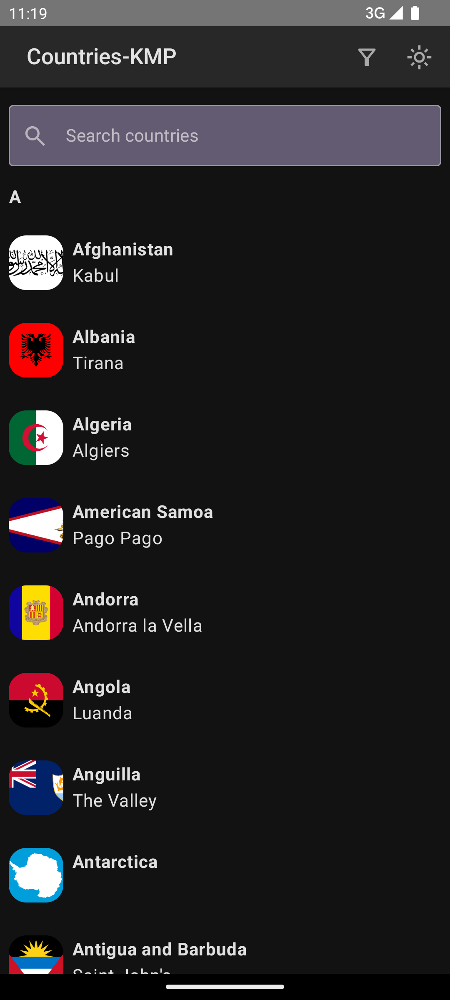
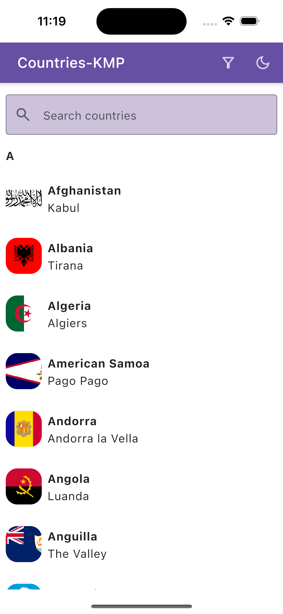
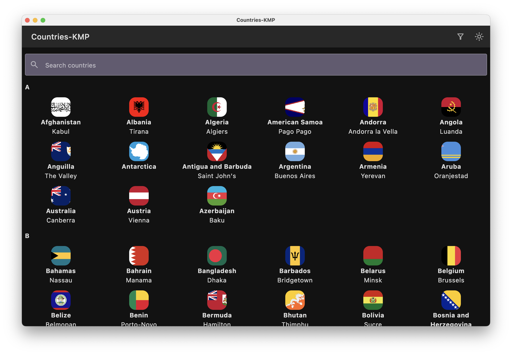

### This is a Kotlin Multiplatform project targeting Android, iOS and Desktop.

### About the project

This is a simple application which gets the list of all countries and shows them grouped in the
alphabetical order

#### Screenshots per platform

| Android                        | iOS                    | Desktop                        |
|--------------------------------|------------------------|--------------------------------|
|  |  |  |

### Tech stack

* Rest API - https://restcountries.com/
* Design inspiration - https://dribbble.com/shots/20115299-Countries-and-their-details
* #### Libraries
    - Rest API Calls - Ktor
    - Local Database - SqlDelight
    - Image Loading - Coil
    - Complex Animations - Lottie
    - App Navigation and ViewModels - Precompose
    - UI Framework - Compose Multiplaform

### Project structure

* `/composeApp` is for code that will be shared across your Compose Multiplatform applications.
  It contains several subfolders:
    - `commonMain` is for code that’s common for all targets.
    - `androidMain` is for Android specific code
    - `desktopMain` is for desktop specific code
    - `iosMain` is for iOS specific code
    - `wasmJsMain` is for WEB specific code (this is planned to be supported in the feature)
* `/iosApp` contains iOS applications. Even if you’re sharing your UI with Compose Multiplatform,
  you need this entry point for your iOS app. This is also where you should add SwiftUI code for
  your project.

### Learning

Learn more
about [Kotlin Multiplatform](https://www.jetbrains.com/help/kotlin-multiplatform-dev/get-started.html),
[Compose Multiplatform](https://github.com/JetBrains/compose-multiplatform/#compose-multiplatform),
[Kotlin/Wasm](https://kotl.in/wasm/)…

### Plans for future

* Add support for WEB (WASM)
* Add weather for each country
